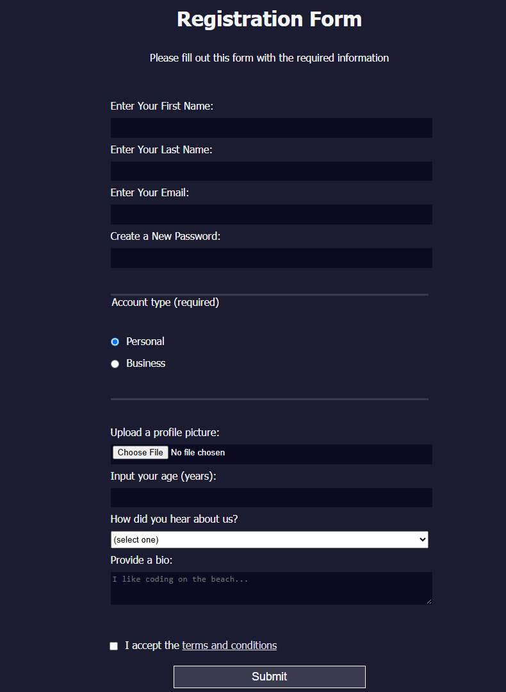

# 📝 Registration Form

A beginner-friendly HTML and CSS project to build a basic registration form layout. This was created as part of the **"Learn HTML Forms"** section in the [freeCodeCamp Responsive Web Design Certification](https://www.freecodecamp.org/).

---

## 📌 Features

- Various input types: text, email, password, radio, checkbox, and submit  
- Semantic HTML structure for better accessibility  
- Basic CSS for form layout and styling  

---

## 🧠 Learning Outcomes

- Building accessible forms using semantic HTML  
- Understanding different form input types  
- Applying consistent spacing and styling with CSS  

---

## 🖼️ Screenshot

---
## 📚 Credits

Project completed during the **"Learn HTML Forms"** module on freeCodeCamp.

